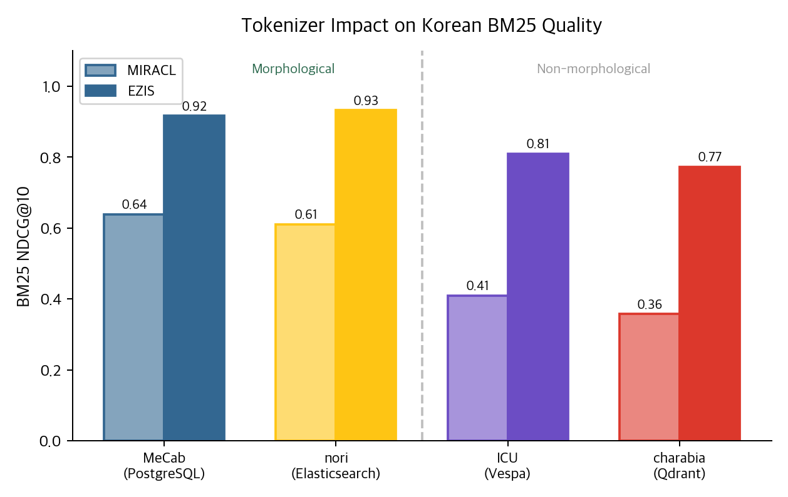
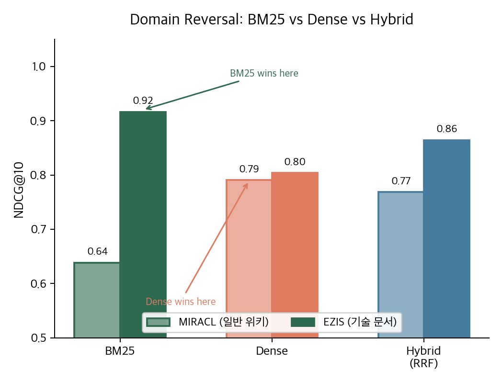
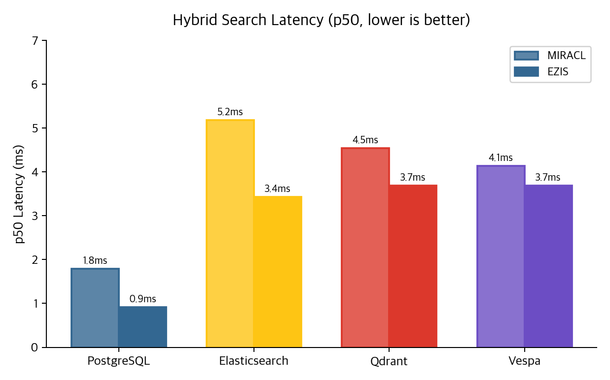
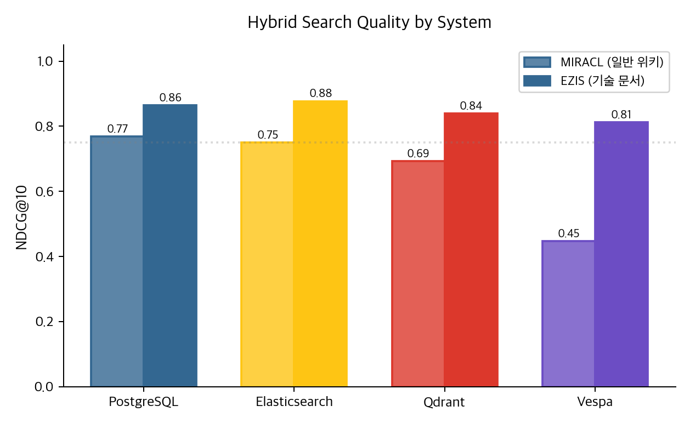
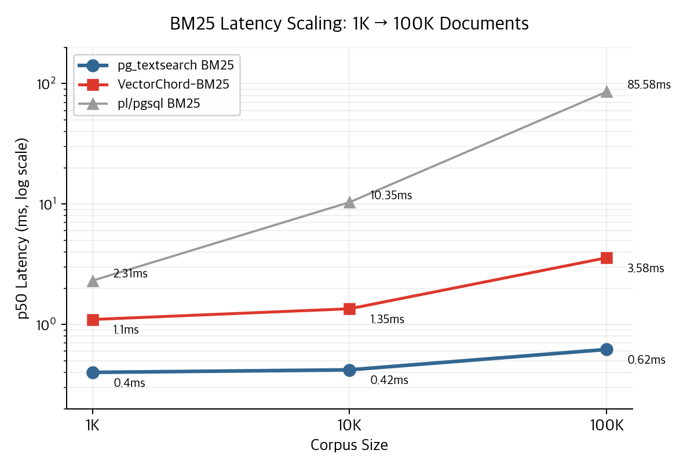

# PostgreSQL만으로 한국어 검색이 된다

PostgreSQL만으로 Elasticsearch를 대체할 수 있을까? 형태소 분석기부터 하이브리드 검색까지, 8단계 실험으로 직접 측정했다.

결론부터 말하면, **된다**.

```
textsearch_ko (MeCab) + pg_textsearch BM25 + pgvector HNSW + DB-side RRF
→ MIRACL NDCG 0.77 @1.79ms / EZIS NDCG 0.86 @0.92ms
```

Elasticsearch와 품질이 동등하고, 단일 노드 기준 latency는 2~5배 빠르다. Qdrant, Vespa 같은 벡터 전용 DB들은 한국어 텍스트 검색에서 구조적으로 밀린다.

---

## 왜 이 실험을 했나

한국어 검색은 영어와 다르다.

영어에서 "running"을 "run"으로 줄이는 스테밍은 규칙 몇 개면 된다. 한국어에서 "먹었다"를 "먹-"으로 분리하려면 형태소 분석기가 필요하다. 이게 없으면 "먹는", "먹고", "먹었던"을 같은 문서로 연결할 수 없고, BM25 검색 품질이 반토막 난다.

Elasticsearch는 nori라는 한국어 형태소 분석기를 내장하고 있어서 이 문제를 바로 해결해준다. PostgreSQL의 기본 full-text search는 한국어를 지원하지 않는다. 그래서 보통 "한국어 검색 = Elasticsearch"가 된다.

그런데 정말 그래야 할까?

`textsearch_ko`라는 확장을 설치하면 MeCab 형태소 분석을 `tsvector`에 연결할 수 있다. `pg_textsearch` 확장을 쓰면 BM25 스코어링이 가능하다. 여기에 `pgvector`로 밀집 벡터 검색을 더하고, SQL CTE 함수로 BM25 + Dense 결과를 RRF로 합치면 — PostgreSQL 하나로 하이브리드 검색 파이프라인이 완성된다.

문제는 "이 조합이 실제로 동작하는가"였다. 확장이 존재하는 것과 프로덕션 품질이 나오는 것은 별개 문제다. 8단계에 걸쳐 직접 측정했다.

---

## 실험에서 알게 된 것

### 토크나이저가 모든 것을 결정한다

한국어 BM25 품질의 대부분은 토크나이저 하나가 설명한다. Phase 1에서 MeCab, Kiwi, Okt 세 가지를 비교했고, MeCab이 적절한 품질과 월등한 처리속도로 이후 모든 실험의 기본 토크나이저가 됐다.



MeCab이나 nori처럼 형태소 분석을 하는 시스템(PostgreSQL, Elasticsearch)은 MIRACL BM25에서 NDCG 0.61~0.64를 달성한다. ICU 유니코드 경계 분리만 하는 Vespa는 0.41, Qdrant의 charabia 토크나이저는 0.36이다.

형태소 분석이 없으면 "데이터베이스"와 "데이터"를 연결할 수 없다. "검색했다"와 "검색"이 별개 토큰이 된다. BM25가 아무리 정교해도 토큰이 틀리면 소용없다.

재미있는 발견이 하나 있다. Elasticsearch의 nori 토크나이저는 OR matching에서는 잘 작동하지만(NDCG 0.61), AND matching에서는 NDCG가 0.13까지 떨어진다. `decompound_mode: mixed`가 복합어를 과도하게 분해해서, 모든 토큰이 존재해야 하는 AND 조건에서 recall이 붕괴된다. 같은 AND 조건에서 PostgreSQL의 `textsearch_ko`는 0.64를 유지했다.

### 도메인에 따라 최적 방법이 뒤집힌다

이 실험의 가장 중요한 설계는 성격이 다른 두 데이터셋을 병행 평가한 것이다.



**MIRACL**(한국어 위키피디아)에서는 Dense 벡터 검색(0.79)이 BM25(0.64)를 크게 앞선다. 의미론적 유사도가 키워드 매칭보다 중요한 도메인이다.

**EZIS**(Oracle DB 매뉴얼)에서는 BM25(0.92)가 Dense(0.80)를 압도한다. "ORA-01555"나 "DBMS_STATS" 같은 정확한 용어 매칭이 의미 유사도보다 중요한 도메인이다.

같은 PostgreSQL 스택이, 같은 하이브리드 설정이, 데이터 성격에 따라 반대 결과를 내놓는다. "어떤 방법이 항상 최고"라는 결론은 불가능하다. 하이브리드(RRF)가 도메인을 모를 때의 안전한 선택인 이유다.

### PostgreSQL이 전문 검색엔진 / 벡터DB보다 느리지 않다

직관적으로 전용 검색 엔진이 범용 DB보다 빠를 것 같지만, 측정 결과는 반대였다.



PostgreSQL의 DB-side RRF는 BM25 쿼리와 Dense 쿼리를 SQL CTE 안에서 실행하고 결과를 합친다. 애플리케이션과 DB 사이의 왕복이 한 번이다. ES나 Qdrant는 HTTP/JSON을 통해 요청을 보내고 받는다. 이 네트워크 오버헤드가 쿼리 자체보다 클 수 있다.

MIRACL 10K 기준 PostgreSQL RRF는 p50 1.79ms, ES는 5.18ms, Qdrant는 4.54ms, Vespa는 4.14ms. 단일 노드 로컬, warm-cache 측정이라는 점은 감안해야 한다. 그리고 Dense 검색의 latency에 BGE-M3 임베딩 추론 시간(~200ms)은 빠져 있다. 쿼리 임베딩을 사전 계산해두고 retrieval-only로 측정했다.

### 품질도 밀리지 않는다



MIRACL Hybrid에서 PostgreSQL(0.77)은 Elasticsearch(0.75)보다 높다. EZIS에서는 ES(0.88)가 PG(0.86)를 근소하게 앞서지만, 통계적 유의성은 검증하지 않았다. Qdrant(0.69/0.84)와 Vespa(0.45/0.81)는 BM25 레그가 약한 만큼 Hybrid 품질도 따라 떨어진다.

핵심은 Hybrid 품질이 BM25 품질에 종속된다는 것이다. BM25 레그가 약하면 Hybrid가 오히려 품질을 깎는다. Vespa MIRACL Hybrid(0.45)가 Dense-only(0.79)보다 나쁜 게 그 증거다.

### Qdrant에는 self-hosted BM25가 없다

Qdrant는 벡터 검색 전용 엔진으로서 구조적으로 가장 우수하다. 양자화, 필터링, 멀티테넌시, 대규모 분산 — 벡터 검색에 필요한 기능이 가장 풍부하다. 하지만 한국어 텍스트 검색은 구조적으로 약하다.

`qdrant/bm25`라는 서버사이드 BM25 모델이 있지만 Qdrant Cloud 전용이다. Self-hosted에서는 쓸 수 없다. 외부에서 MeCab으로 토크나이징한 뒤 sparse vector로 넣어봤는데, 이건 TF x IDF일 뿐 진짜 BM25가 아니다. 문서 길이 정규화(k1, b 파라미터)가 빠져 있어서 NDCG가 0.36에 그쳤다.

### Vespa는 한국어 형태소 분석을 기본 지원하지 않는다

Vespa 자체는 BM25 + ANN hybrid를 선언적으로 잘 지원하는 시스템이다. 하지만 기본 토크나이저가 ICU(유니코드 경계 분리)라서 한국어 형태소 분석을 안 한다. `vespa-linguistics-ko`라는 MeCab 기반 패키지가 있지만 커스텀 빌드가 필요하고 표준 Docker 이미지에는 포함되어 있지 않다.

ICU BM25가 노이즈를 생성해서 `0.1*bm25 + closeness` 선형 결합 결과가 Dense-only(0.79)보다 나쁜 0.45를 기록했다.

---

## 주요 수치

### 시스템 간 비교 (Phase 8)

| 시스템 | MIRACL Hybrid | EZIS Hybrid | p50 |
|--------|:---:|:---:|:---:|
| **PostgreSQL (RRF)** | **0.7683** | 0.8641 | **1.79ms** |
| ES 8.17 (nori, retriever.rrf) | 0.7501 | **0.8769** | 5.18ms |
| Qdrant 1.15 (MeCab sparse + dense) | 0.6924 | 0.8394 | 4.54ms |
| Vespa (ICU + HNSW) | 0.4463 | 0.8125 | 4.14ms |

### PostgreSQL 내부 비교 (Phase 7)

| 방법 | MIRACL NDCG@10 | EZIS NDCG@10 | p50 |
|------|:---:|:---:|:---:|
| pg_textsearch BM25 (MeCab) | 0.6385 | 0.9162 | 0.44ms |
| Dense (BGE-M3 HNSW) | 0.7904 | 0.8041 | 1.2ms |
| RRF hybrid (DB-side) | 0.7683 | 0.8641 | 1.79ms |
| Bayesian hybrid (DB-side) | 0.7272 | 0.9249 | 9.55ms |

### BM25 스케일링 (Phase 6~7)



`pg_textsearch`는 100K 문서에서도 0.62ms를 유지한다. `pl/pgsql` 구현이 85ms로 폭발하는 것과 대비된다. 인덱스 크기도 18MB vs 501MB로 27배 차이다.

---

## 데이터셋

| 데이터셋 | 성격 | 쿼리 | 코퍼스 | 특징 |
|---------|------|:---:|:---:|------|
| MIRACL-ko | 일반 위키피디아 | 213 | 10K | Dense 유리 |
| EZIS Oracle Manual | 기술 매뉴얼 | ~120 | ~200 | BM25 유리 |

성격이 다른 두 데이터셋을 병행 평가해서, "어떤 방법이 항상 최고"라는 착각을 방지했다.

---

## 실험 단계

| Phase | 무엇을 했나 | 핵심 발견 |
|:---:|------|------|
| 0 | MIRACL-ko + EZIS 데이터 준비 | — |
| 1 | 형태소 분석기 비교 (MeCab vs Kiwi vs Okt) | MeCab이 속도·품질 모두 1위 |
| 2 | PostgreSQL tsvector 한국어 통합 | `textsearch_ko`로 MeCab → tsvector 연결 |
| 3 | PostgreSQL 내부 BM25 구현 비교 | pl/pgsql과 pg_textsearch 양강 |
| 4 | BM25 vs Neural (Dense, SPLADE) | 도메인에 따라 역전, hybrid가 안전 |
| 5 | Production 최적화 (incremental, concurrency) | pl/pgsql v2 + BGE-M3 조합 확정 |
| 6 | VectorChord-BM25 스케일링 (1K/10K/100K) | VectorChord가 pl/pgsql 대비 24배 빠름 |
| 7 | pg_textsearch 하이브리드 (RRF, Bayesian) | pg_textsearch가 전 스케일 최속, RRF 확정 |
| 8 | 외부 시스템 비교 (ES / Qdrant / Vespa) | PG 스택이 품질 동등, latency 2~5배 우위 |

```
Phase 0 → Phase 1 → Phase 2 (tsvector)
                   → Phase 3 (BM25) → Phase 4 (vs Neural) → Phase 5 (Production)
                     → Phase 6 (VectorChord) → Phase 7 (하이브리드) → Phase 8 (외부 비교)
```

상세 분석: [docs/results/](docs/results/)

---

## 빠른 시작

```bash
# 복제 및 환경 구성
git clone https://github.com/ysys143/textsearch.git
cd textsearch
uv venv && source .venv/bin/activate && uv sync

# PostgreSQL + pgvector 시작
docker compose --profile core up -d

# 접속 확인
psql -h localhost -U postgres -d dev -c "SELECT version();"
```

### Phase 8 실행

```bash
# 임베딩 내보내기 (PG → JSON)
uv run python3 experiments/phase8_system_comparison/export_embeddings.py

# ES / Qdrant / Vespa 벤치마크
docker compose --profile phase8-es up -d
uv run python3 experiments/phase8_system_comparison/phase8_es.py

docker compose --profile phase8-qdrant up -d
uv run python3 experiments/phase8_system_comparison/phase8_qdrant.py

docker compose --profile phase8-vespa up -d
uv run python3 experiments/phase8_system_comparison/phase8_vespa.py --vespa-url http://localhost:8090

# 통합 리포트
uv run python3 experiments/phase8_system_comparison/phase8_report.py
```

---

## 프로젝트 구조

```
textsearch/
├── data/                           # MIRACL-ko + EZIS 데이터
├── docs/
│   ├── plan/                       # 실험 계획서 (Phase 0~8)
│   ├── results/                    # 실험 결과 분석
│   │   ├── phase7_pg_best_stack.md
│   │   ├── phase8_system_comparison.md
│   │   ├── phase8_compare_es.md
│   │   ├── phase8_compare_qdrant.md
│   │   └── phase8_compare_vespa.md
│   └── source-analysis/            # PG 확장 소스 분석
├── experiments/                    # 실험 코드 (Phase별)
├── extensions/                     # 커스텀 PG 확장
│   ├── textsearch_ko/              # MeCab 한국어 토크나이저
│   └── korean_bigram/              # 한국어 음절 파서
├── vendor/                         # 외부 참조 소스
├── results/                        # 실험 결과 JSON
├── docker-compose.yml              # PG, ES, Qdrant, Vespa
└── README.md
```

---

## 관련 프로젝트

| 프로젝트 | 역할 |
|---------|------|
| [mecab-ko](https://github.com/hephaex/mecab-ko) | 한국어 형태소 분석기 (MeCab fork) |
| [textsearch_ko](https://github.com/i0seph/textsearch_ko) | PostgreSQL 한국어 FTS 확장 |
| [textsearch_ko fork](https://github.com/ysys143/textsearch_ko) | 이 프로젝트에서 사용하는 fork |
| [pg_textsearch](https://github.com/timescale/pg_textsearch) | Timescale BM25 확장 |
| [pgvector](https://github.com/pgvector/pgvector) | PostgreSQL 벡터 검색 (HNSW/IVFFlat) |
| [pgvectorscale](https://github.com/timescale/pgvectorscale) | Timescale DiskANN 벡터 인덱스 |
| [VectorChord](https://github.com/tensorchord/VectorChord) | DiskANN + Block-WeakAnd BM25 |
| [BGE-M3](https://huggingface.co/BAAI/bge-m3) | 다국어 1024-dim 임베딩 모델 |

## 측정 조건과 한계

- 모든 latency는 단일 노드, warm-cache, retrieval-only 측정이다.
- Dense 검색 latency에 BGE-M3 임베딩 추론 시간(~200ms)은 포함되지 않았다.
- PG 수치는 Phase 7 실측값 재사용이며, 동일 시점 head-to-head가 아닌 cross-phase 비교다.
- BM25 query semantics가 시스템마다 다르다: PG는 AND, ES는 OR, Vespa는 weakAnd.
- Bootstrap CI, p-value 등 통계적 유의성 검증은 미적용이다.

## 시스템 요구사항

- Python 3.12+
- PostgreSQL 15+ (pgvector 0.8.2)
- Docker 24.0+ (메모리 8GB 이상 권장)
- macOS 또는 Linux

## 라이센스

MIT

---

**Last Updated**: 2026-03-25 | Phase 8 완료
